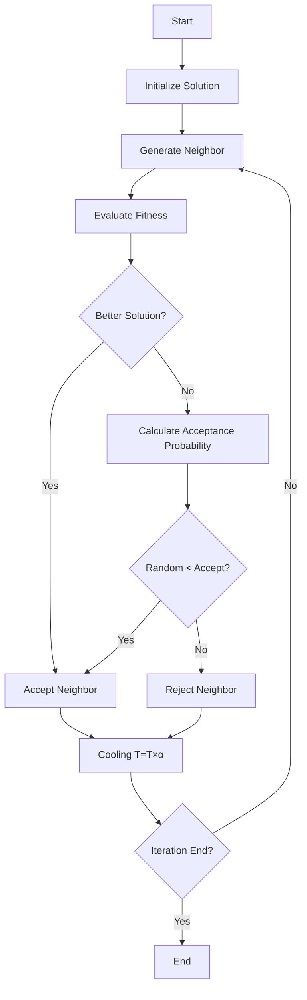

# Simulated Annealing

## Overview

Simulated Annealing (SA) is a stochastic optimization algorithm inspired by the annealing process in metallurgy. Unlike Hill Climbing, which only accepts better solutions, SA occasionally accepts worse solutions with a certain probability, allowing it to escape local optima and explore the search space more effectively.

This implementation supports:

* OneMax Problem
* Deceptive Problem

## Input Parameters

| Parameter   | Description                |
| ----------- | -------------------------- |
| Bit         | Length of binary solution  |
| Run         | Number of independent runs |
| Iteration   | Maximum iterations         |
| Rate        | Bit-flip mutation rate     |
| ProblemType | 0 = OneMax, 1 = Deception  |

## Procedure

#### <ins>Initialization</ins>
**Init()**: An initial binary solution is generated randomly.
* current_solution = [0,1,0,1,1,...]
* Initial temperature: 100
* Cooling rate = 0.99

#### <ins>Algorithm Procedure</ins>
<ins>Step 1. Generate Neighbor Solution</ins>

A neighboring solution is generated from the current solution.
For every bit:
Random(0,1) < Rate
If true:
* 0 → 1
* 1 → 0
 Otherwise the bit remains unchanged.
The resulting solution is evaluated: next_solution

<ins>Step 2. Accept Better Solution</ins>

If the neighboring solution has a better fitness value:
f(next_sol) > f(current_sol)
 the new solution is accepted directly:
current_sol = next_sol

<ins>Step 3. Probabilistic Acceptance of Worse Solutions</ins>

If the neighboring solution is worse: f(next_sol) ≤ f(current_sol)

Simulated Annealing does not immediately reject it.

Instead, an acceptance probability is calculated:

Accpt = e^((f(next_sol)-f(current_sol))/T)

Generate a random number: P ∈ [0,1]

Decision rule: 
if P < Accept：accept next_sol
    
else：reject next_sol

<ins>Step 4. Cooling Schedule</ins>

After each iteration, the temperature is decreased according to:

T = T × α

## Flow Chart

  
          
